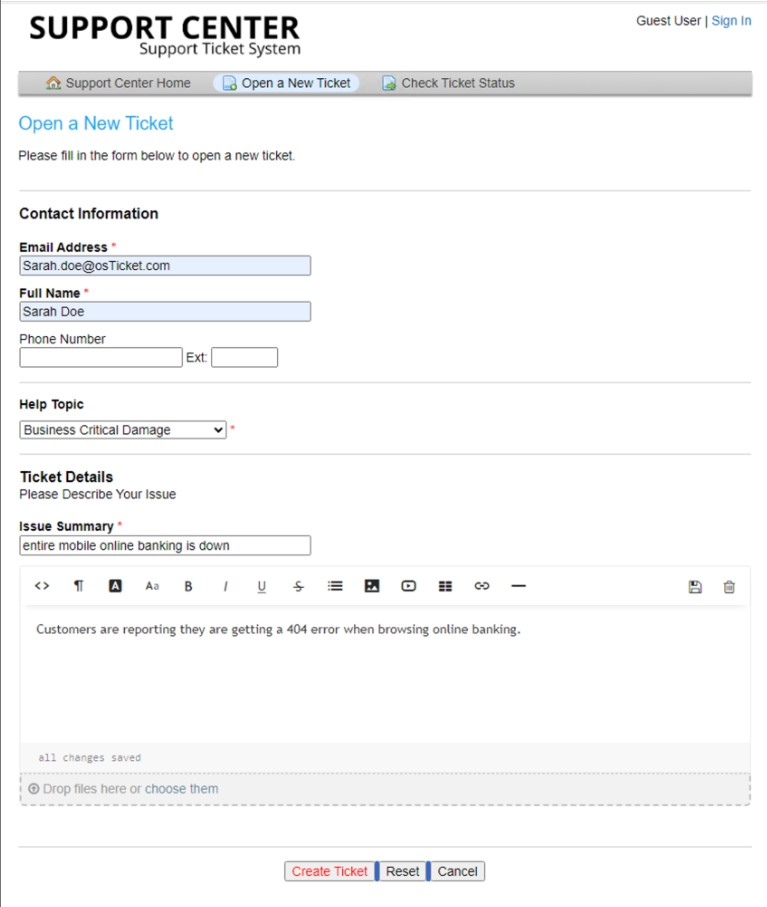
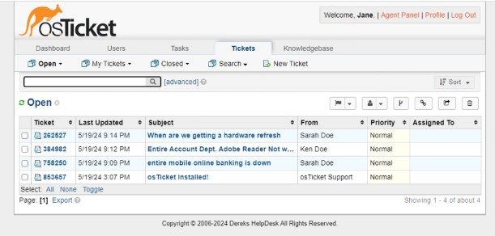
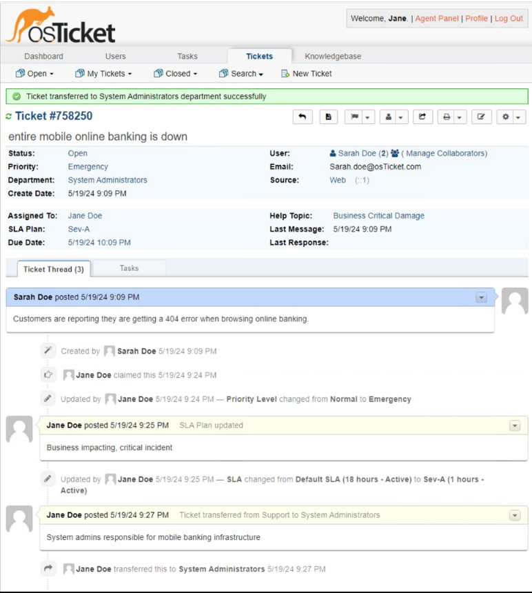
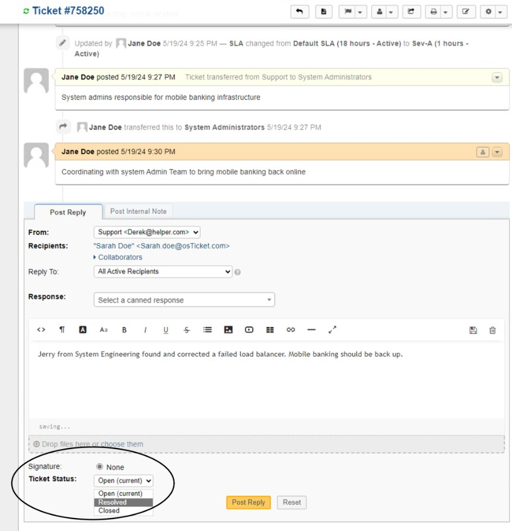
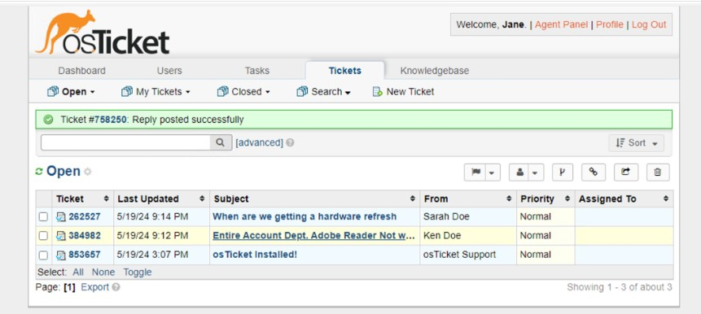
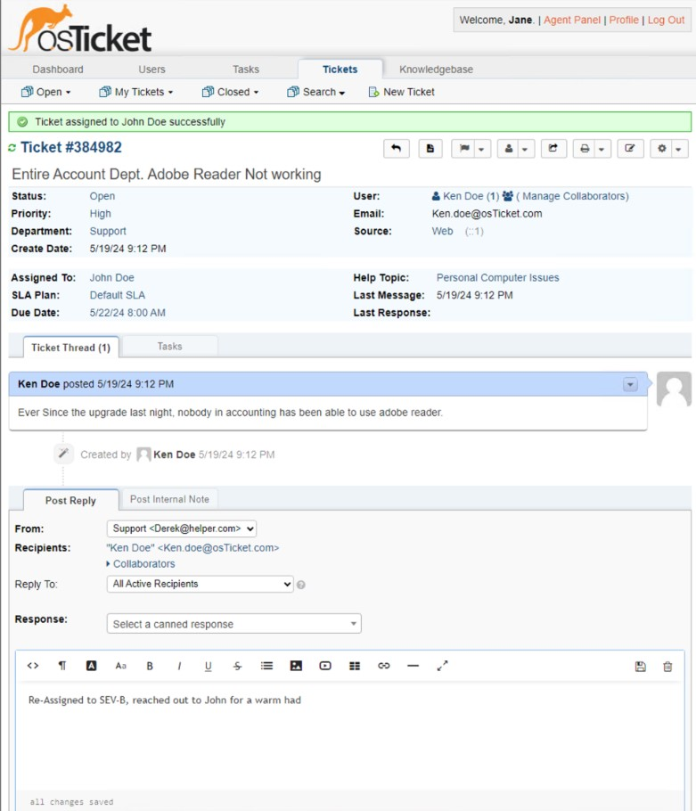
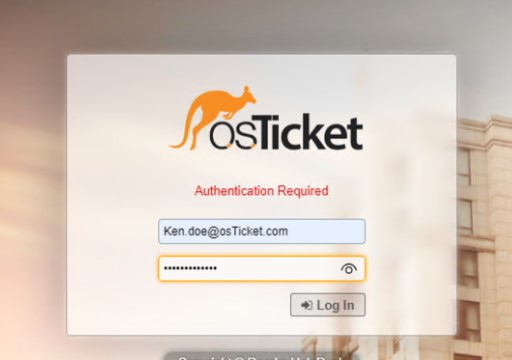
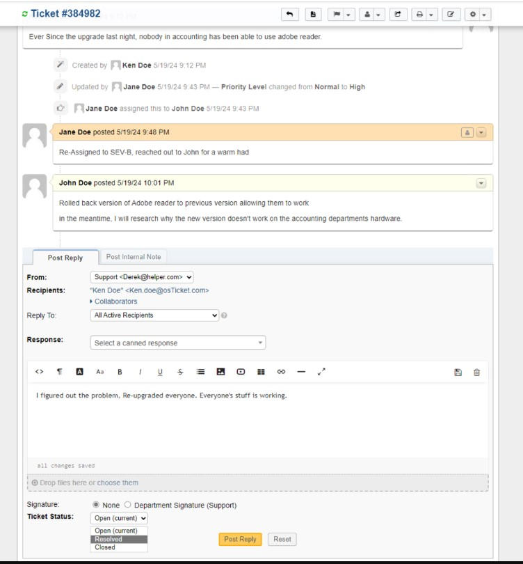
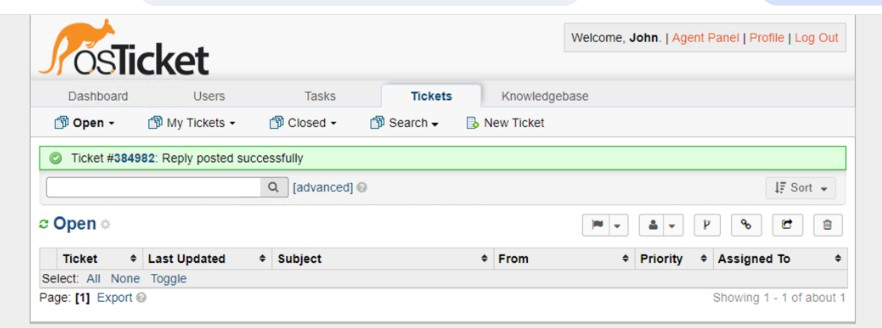

<h1>osTicket - Ticket Lifecycle: Intake Through Resolution</h1>
This tutorial outlines the lifecycle of a ticket from intake to resolution within the open-source help desk ticketing system osTicket. 

<h2>Environments and Technologies Used</h2>

- Microsoft Azure (Virtual Machines/Compute)
- Remote Desktop
- Internet Information Services (IIS)

<h2>Operating Systems Used </h2>

- Windows 10</b> (21H2)

<h2>Ticket Lifecycle Stages</h2>

- Intake
- Assignment and Communication
- Working the Issue
- Resolution

<h2>Lifecycle Stages</h2>

On your browser, go to http://localhost/osticket/

- Create a couple of tickets as an external user

 

Logout from osTicket and log back in as an Agent

 

Open one of the tickets

- Make sure the settings on the tickets are proper
- Make sure the severity and SLA are set properly
- Assign the ticket to an agent
- Post a Reply

When the ticket has been resolved

- Post another reply letting them know the issue has been resolved
- Change the ticket Status from "Open" to "Resolved"

Back on Open osTickets

- Click on another open ticket

Like the last ticket, make sure the settings are set properly

- Assign to a different agent this time

For the last ticket

- Sign in as the agent assigned for this ticket
- Make sure all the settings are set properly
- Close the ticket letting them know it has been resolved

When all the tickets are done, this is how the open ticket page should be.

 
